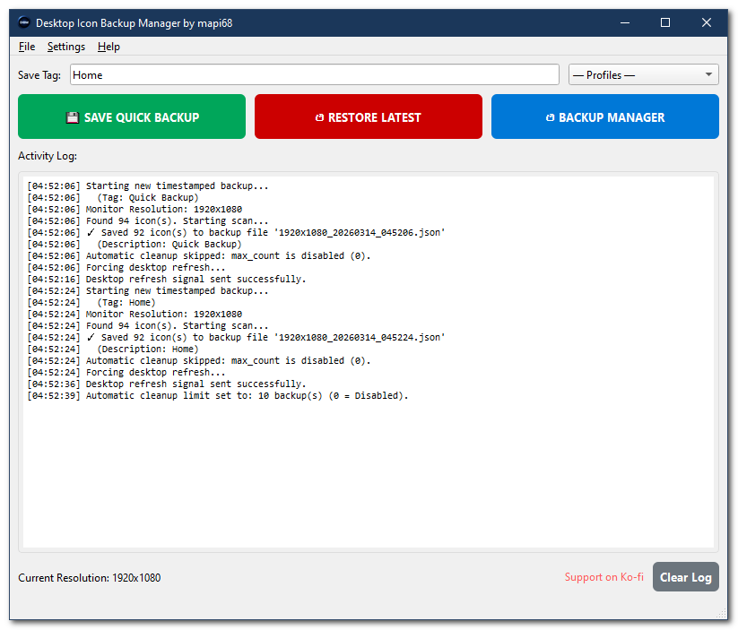
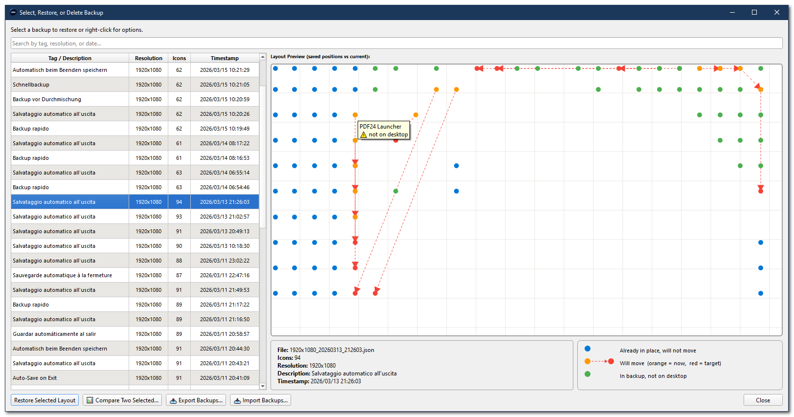
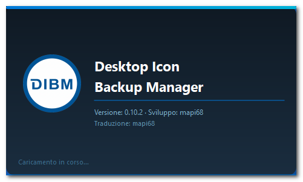
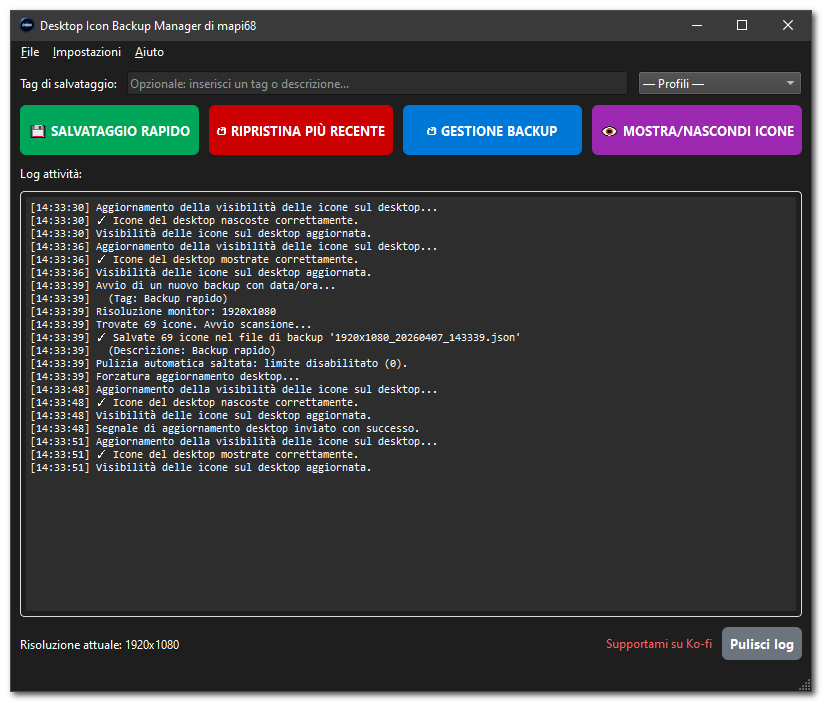
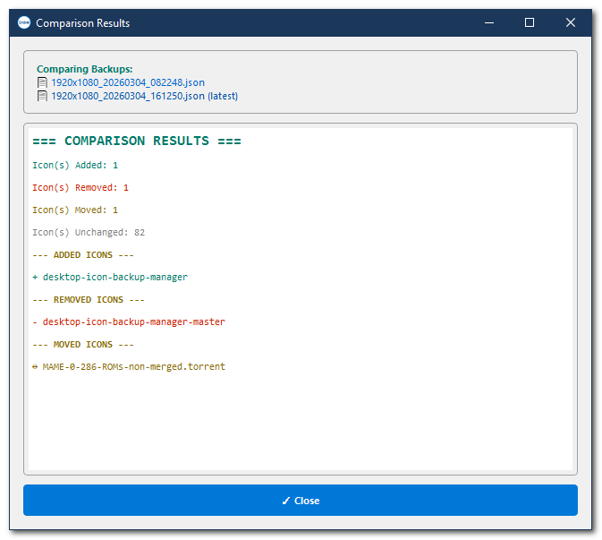
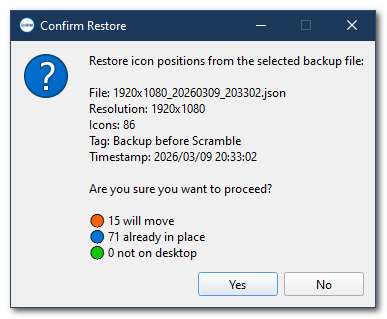

# Desktop Icon Backup Manager

[](https://ko-fi.com/mapi68)

[](https://www.python.org)
[](https://www.microsoft.com/windows)
[](https://github.com/mapi68/desktop-icon-backup-manager/releases)
[](https://github.com/mapi68/desktop-icon-backup-manager/releases)
[](https://opensource.org/licenses/MIT)

---

**Desktop Icon Backup Manager** is the most feature-complete free, open-source tool to **save, restore, and manage desktop icon positions and layouts on Windows**. Unlike simpler alternatives, it gives you a **live visual diff preview before every restore**, **adaptive scaling across resolutions**, **multi-monitor warnings**, and **full CLI automation** — all in a single portable `.exe` with no installation required.

> **TL;DR:** Windows keeps moving your desktop icons. This tool saves your exact layout and restores it in one click — with a preview of what will change before you commit. Free, open source, portable. Works on Windows 7, 10, 11 (up to 25H2).

---

## 😤 Sound familiar?

Windows has had a well-known, never-fixed bug since Windows 7: desktop icons rearrange themselves without any warning. Every version of Windows — including Windows 11 25H2 — still suffers from it. Here are the most common triggers:

- 🔄 **After a Windows Update** — icons reset to the left side or sort into alphabetical order
- 🖥️ **After connecting or disconnecting an external monitor or docking station** — the entire layout collapses onto the primary screen
- 🎮 **After playing a full-screen game** — the game changes the screen resolution, and Windows scrambles all icon positions on exit
- 💤 **After sleep, hibernate, or lock screen** — icons shift position, especially along the right edge of the screen
- 🔌 **After changing screen resolution or DPI scaling** — icons pile up in the top-left corner
- 📺 **After switching between laptop screen and a TV or projector** — the layout is completely lost
- 🔁 **After a reboot** — Windows ignores your carefully arranged positions and auto-arranges instead

If any of these scenarios sound familiar, **Desktop Icon Backup Manager is exactly what you need**.
Save your perfect desktop layout once. Restore it in seconds — and see a colour-coded preview of every icon that will move *before* you click Restore.

---

## 📖 Documentation

[](https://mapi68.github.io/desktop-icon-backup-manager/manual.pdf)

> [!TIP]
> Full documentation is always available here: [User Manual (PDF)](https://mapi68.github.io/desktop-icon-backup-manager/manual.pdf)

---

## 🛠️ Development Status

[](https://github.com/mapi68/desktop-icon-backup-manager/graphs/commit-activity)
[](https://github.com/mapi68/desktop-icon-backup-manager/commits/master)
[](https://github.com/mapi68/desktop-icon-backup-manager/releases)

---

## ✨ What Makes This Tool Different

Most icon layout tools do one thing: save a list of coordinates and restore them. **Desktop Icon Backup Manager goes much further.**

### 🔍 Live Diff Preview — Unique to This Tool
Before restoring any backup, you see a **colour-coded live overlay** showing *exactly* which icons will move, which are already in position, and which exist in the backup but are missing from your current desktop. No other free tool offers this. You always know what will happen before you click Restore — no surprises.

| Colour | Meaning |
|--------|---------|
| 🔵 **Blue** (with soft halo) | Already in the correct position — will not move |
| 🟠 **Orange** ──▶ 🔴 **Red** | Will move: orange = current position, red = saved destination |
| 🟢 **Green** | In the backup, but not currently on the desktop — will be skipped |

### 🔄 Adaptive Scaling — Restore Across Different Resolutions
When you restore a backup saved at 1920×1080 onto a 2560×1440 display, icon positions are **automatically recalculated proportionally** so they land in the right area of the new screen. Icons no longer pile up in a corner. This works seamlessly across any resolution change — including DPI scaling differences.

### ⚖️ Compare Any Two Backups
Not just "current vs. backup" — you can select **any two saved layouts** and diff them side by side. See exactly which icons were added, removed, or moved between two points in time. Useful for tracking how your desktop evolved, or for choosing which of two old snapshots to restore.

### 🖥️ Multi-Monitor Awareness
Every backup records the full monitor configuration (count, resolution, arrangement). When you restore on a different setup, **the app warns you** before proceeding. Create named backups for each configuration — `Laptop Only`, `Office Dock`, `Home TV` — and switch between them instantly.

### ⚡ Full CLI Automation
Run backup and restore operations silently from the command line, Windows Task Scheduler, login scripts, or batch files — with no GUI at all. Schedule automatic desktop icon backups at login, and your layout is always safe without any manual effort.

### 🔓 Fully Open Source
Every line of code is on GitHub, MIT licensed, auditable, and forkable. No telemetry, no ads, no account, no cloud. Your backup files are plain JSON — human-readable and portable between machines.

---

## 🚀 Features at a Glance

### Core — Save and Restore Desktop Icon Layouts
- **💾 Quick Backup**: Save your entire desktop icon layout with one click; add an optional tag like `Before Update` or `Dual Monitor Setup`
- **↺ One-Click Restore**: Restore icon positions from the latest backup, or pick any snapshot from the Backup Manager
- **🏷️ Custom Tags**: Label each backup for easy identification — no more guessing which snapshot is which
- **📋 Profiles**: A built-in dropdown of 14 ready-made profile names — *Work, Gaming, Presentation, Dev / Coding, Meeting, Home, Office, Laptop, Docked / External Monitor, Clean Desktop, Pre-Update, Pre-Reboot, Favourite, Test* — one click pre-fills the tag field; you can then use it as-is or refine it freely
- **📊 Resolution & Monitor Metadata**: Every backup records screen resolution, DPI, and monitor count

### Advanced Features
- **🔍 Live Diff Preview**: Colour-coded overlay before every restore — see what will move, stay, or be skipped *(unique feature)*
- **🖼️ Visual Dot-Map Preview**: Mini-map of all icon positions with hover tooltips showing icon names
- **🔄 Adaptive Scaling**: Proportional position recalculation when restoring to a different resolution or DPI
- **🖥️ Multi-Monitor Support + Warnings**: Full multi-monitor save/restore with automatic alerts on config mismatch
- **⚖️ Backup Comparison**: Diff any two saved layouts against each other *(unique feature)*
- **✏️ Inline Tag Editing**: Double-click any tag in the Backup Manager table to rename it in place — no dialog needed
- **📤 Export Backups**: Export selected or all backups to a folder or a ZIP archive for portability, sharing, or off-site storage
- **📥 Import Backups**: Import `.json` backup files or ZIP archives from another machine or installation — duplicates are safely skipped
- **🗑️ Smart Auto-Cleanup**: Keep only the N most recent backups (5 / 10 / 25 / 50 / unlimited)
- **⚡ System Tray**: Save or restore silently from the tray icon — no need to open the main window

### Automation & CLI
- **Auto-Save on Exit**: Backup icon positions automatically every time the app closes
- **Auto-Restore on Startup**: Restore your layout automatically every time Windows starts
- **🔔 Update Checker**: Automatic check for new versions at startup (optional) with one-click download link; also available manually via Help → Check for Updates
- **Command Line Interface**: Full `--backup`, `--restore`, `--silent` support for scripting and Task Scheduler
- **Background Threading**: Save/restore never freezes the UI — live progress indicator always visible

### Usability
- **📋 Sortable + Filterable Backup Table**: Sort by tag, resolution, icon count, or timestamp; real-time search filter
- **↔️ Fully Resizable Windows**: Adapts to any screen size or DPI setting
- **🌍 24 Languages**: Auto-detected from Windows locale, or manually overridden. Available in English, Arabic, Czech, German, Greek, Spanish, Finnish, French, Hindi, Italian, Japanese, Korean, Norwegian Bokmål, Dutch, Polish, Portuguese (BR), Portuguese (PT), Romanian, Russian, Swedish, Turkish, Ukrainian, Simplified Chinese, and Traditional Chinese
- **⌨️ Full Keyboard Navigation**: Every action has a shortcut — see the [shortcuts table](#%EF%B8%8F-keyboard-shortcuts)
- **📋 Timestamped Activity Log**: Full operation history with timestamps; copy with `Ctrl+A` / `Ctrl+C`
- **🗒️ Persistent Log File**: Every operation is silently written to `history.log` next to the executable (max 500 entries, auto-trimmed). The log file persists across sessions — useful for auditing or troubleshooting past operations. "Clear Log" also clears the file
- **✅ Confirmation Dialogs**: Always confirms before overwrite or delete — no accidents

---

## 🔍 How Desktop Icon Backup Manager Compares

There are a few tools in this space. Here is how they stack up:

| Feature | **Desktop Icon Backup Manager** | ReIcon | DesktopOK | Windows built-in |
|---|:---:|:---:|:---:|:---:|
| Save icon positions | ✅ | ✅ | ✅ | ❌ |
| Restore icon positions | ✅ | ✅ | ✅ | ❌ |
| **Live diff preview before restore** | ✅ | ❌ | ❌ | ❌ |
| **Visual dot-map layout preview** | ✅ | ❌ | ❌ | ❌ |
| **Compare any two backups** | ✅ | ❌ | ❌ | ❌ |
| **Inline tag editing** | ✅ | ❌ | ❌ | ❌ |
| **Export / Import backups (ZIP or folder)** | ✅ | ❌ | ❌ | ❌ |
| Adaptive scaling (resolution change) | ✅ | ✅ | ❌ | ❌ |
| Multi-monitor support + warnings | ✅ | ✅ | ✅ | ❌ |
| CLI / Task Scheduler automation | ✅ | ✅ | ❌ | ❌ |
| Search / filter saved backups | ✅ | ❌ | ❌ | ❌ |
| Auto-save on exit | ✅ | ⚠️ partial | ✅ | ❌ |
| Auto-restore on startup | ✅ | ⚠️ via shortcut | ✅ | ❌ |
| **Update checker (with tray notification)** | ✅ | ❌ | ❌ | ❌ |
| System tray integration | ✅ | ✅ | ✅ | ❌ |
| Context menu integration | ❌ | ✅ | ❌ | ❌ |
| **Open source (MIT)** | ✅ | ❌ | ❌ | — |
| Portable (no install required) | ✅ | ✅ | ✅ | — |
| **Actively maintained for Windows 11 25H2** | ✅ | ✅ | ⚠️ | — |
| Multi-language UI | ✅ | ❌ | ✅ | — |
| Free | ✅ | ✅ | ✅ | — |

> **The bolded rows are where Desktop Icon Backup Manager stands apart.** No other free tool offers a live diff preview, visual layout preview, or cross-backup comparison. These features mean you always know exactly what will happen before you restore — and you can audit your backup history with confidence.
>
> **ReIcon** (by Sordum) is a good lightweight option with CLI support and resolution scaling. It lacks visual previews, diff comparison, and backup search — it is simpler but also more limited.
> **DesktopOK** is the oldest and best-known tool in this category, but it is closed source, has no CLI, no diff preview, and its Windows 11 updates are infrequent.

---

## 📋 Requirements

- **Windows 7, 8, 10, or 11** (32-bit and 64-bit, up to Windows 11 25H2)
- Python 3.8+ — **only needed if running from source**; the `.exe` has zero external dependencies
- Desktop icons must be visible (`Right-click desktop → View → Show desktop icons`)
- No administrator rights required — runs as a standard user

---

## 🚀 Getting Started

### Option 1: Download the Portable Executable (Recommended)

No installation. No Python. No dependencies. Download and run.

1. Go to the [Releases](../../releases) page
2. Download the latest zip file
3. Extract it in any folder (e.g. `C:\Tools\`)
4. Run `Desktop Icon Backup Manager.exe`
5. The `icon_backups` folder and `settings.ini` are created automatically

### Option 2: Run from Source (Python)

```bash
git clone https://github.com/mapi68/desktop-icon-backup-manager.git
cd desktop-icon-backup-manager
pip install -r requirements.txt
python main.py
```

**Dependencies:** `PyQt6`, `pywin32`

---

## 📖 How to Use

### Saving Your Desktop Icon Layout

1. *(Optional)* Type a descriptive tag — e.g. `Work Setup`, `Before Win Update`, `Gaming Mode`
   - Or click the **Profiles** dropdown to the right of the tag field and pick one of the 14 built-in names (*Work, Gaming, Presentation, Dev / Coding, Meeting, Home, Office, Laptop, Docked / External Monitor, Clean Desktop, Pre-Update, Pre-Reboot, Favourite, Test*). The selected name is copied into the tag field instantly — edit it further if you like, then save.
2. Click **💾 SAVE QUICK BACKUP** or press `Ctrl+S`

A compact JSON snapshot of all icon positions and screen metadata is saved instantly to the `icon_backups` folder. Each file is 2–10 KB.

> [!NOTE]
> `Ctrl+S` always tags the backup as *"Quick Backup (Shortcut)"*. To save with a custom tag, use the button.

### Restoring Your Desktop Icon Positions

- **Quick restore**: Click **↺ RESTORE LATEST** — restores the most recent backup after a confirmation prompt
- **Full control**: Click **↺ BACKUP MANAGER** (`Ctrl+M`) — browse, search, preview the live diff, compare snapshots, and restore any saved layout

### Editing a Backup Tag

In the Backup Manager, **double-click any row in the Tag / Description column** to edit the label inline. Press `Enter` or click elsewhere to save; press `Escape` to cancel. The change is written immediately to the `.json` file.

> [!NOTE]
> Double-clicking columns 2–4 (Resolution, Icons, Timestamp) still opens the restore dialog as usual — those columns are read-only.

### Exporting Backups

1. Open **↺ BACKUP MANAGER** (`Ctrl+M`)
2. Click **📤 Export Backups...** (bottom toolbar) — or use **File → 📤 Export Backups...**
3. Choose what to export: *selected backup only* or *all backups*
4. Choose the format:
   - **ZIP archive** — saves everything in a single `.zip` file
   - **Folder** — copies the `.json` files into a destination folder of your choice
5. A summary confirms how many files were exported

### Importing Backups

1. Open **↺ BACKUP MANAGER** (`Ctrl+M`)
2. Click **📥 Import Backups...** (bottom toolbar) — or use **File → 📥 Import Backups...**
3. Select one or more `.json` files and/or `.zip` archives
4. The importer validates each file before copying; files that already exist in `icon_backups` are **skipped** (never overwritten)
5. A summary shows: ✓ imported, ⏭ skipped (already exist), and any errors

### Automating with the CLI

```bash
# Silent backup — no window, exits immediately
desktop-icon-backup-manager.exe --backup --silent

# Restore the most recent layout silently
desktop-icon-backup-manager.exe --restore latest --silent

# Restore a specific saved layout by filename
desktop-icon-backup-manager.exe --restore "1920x1080_20241211_143015.json" --silent
```

**Exit codes:** `0` = success, `1` = error.

**Auto-backup at Windows login via Task Scheduler:**
1. Open **Task Scheduler** → *Create Basic Task*
2. Trigger: *When I log on*
3. Action: *Start a program* → select `desktop-icon-backup-manager.exe`
4. Arguments: `--backup --silent`

---

### Settings Reference

| Setting | Description |
|---------|-------------|
| **Start Minimized to Tray** | Launch hidden — zero visual footprint |
| **Auto-Save on Exit** | Silently back up icon positions every time the app closes |
| **Auto-Restore on Startup** | Silently restore the latest layout every time the app starts |
| **Enable Adaptive Scaling on Restore** | Recalculate positions proportionally when restoring to a different resolution |
| **Minimize to Tray on Close** | Clicking × hides to tray instead of quitting |
| **Check for Updates on Startup** | Automatically checks GitHub for a new version 10 seconds after launch — a tray notification and log entry appear if an update is available |
| **Automatic Backup Cleanup Limit** | Auto-delete oldest backups — keep 5, 10, 25, 50, or unlimited |

> [!WARNING]
> Enabling both **Auto-Save on Exit** and **Auto-Restore on Startup** creates a cycle: whatever layout is on screen when you close the app gets saved and restored next boot — including a broken layout. If icons are already in the wrong positions, use the Backup Manager to restore a known-good snapshot first.

---

## ⚙️ Configuration File

Settings are stored in `settings.ini` next to the executable, created automatically on first run:

```ini
[General]
start_minimized=false
auto_save_on_exit=false
auto_restore_on_startup=false
check_updates_on_startup=true
adaptive_scaling_enabled=false
close_to_tray=false
cleanup_limit=0
geometry=@Rect(100 100 800 650)
```

Edit with any text editor. Invalid values reset to defaults on next launch.

---

## ⌨️ Keyboard Shortcuts

| Shortcut | Action |
|----------|--------|
| `Ctrl+S` | Save desktop icon layout (Quick Backup) |
| `Ctrl+M` | Open Backup Manager |
| `Ctrl+,` | Open Settings |
| `Ctrl+Q` | Exit application |
| `F1`     | Open User Manual (PDF) |

---

## 📁 Backup File Format

Backups are stored as human-readable JSON files in the `icon_backups` subfolder:

```
{width}x{height}_{YYYYMMDD}_{HHMMSS}.json
Example: 1920x1080_20241211_143015.json
```

```json
{
    "timestamp": "2024-12-11T14:30:15.123456",
    "icon_count": 12,
    "description": "Work Setup Final",
    "display_metadata": {
        "monitor_count": 2,
        "primary_resolution": "1920x1080",
        "screens": [...]
    },
    "icons": {
        "This PC": [100, 200],
        "Recycle Bin": [100, 350]
    }
}
```

Plain text, portable, and easy to copy between machines. 50 backups take less than 500 KB.

---

## ❓ Frequently Asked Questions

**Can I rename a backup tag without deleting and re-creating it?**
Yes — in the Backup Manager, double-click the tag cell in the first column to edit it directly in the table. The change is saved to the `.json` file immediately.

**What are Profiles and how do I use them?**
Profiles is a built-in dropdown next to the tag field on the main window. It contains 14 pre-made names (*Work, Gaming, Presentation, Dev / Coding, Meeting, Home, Office, Laptop, Docked / External Monitor, Clean Desktop, Pre-Update, Pre-Reboot, Favourite, Test*) to help you tag backups consistently without having to type from scratch. Select one and the name is copied into the tag field — you can keep it as-is or edit it before saving. All profile names are fully translated into the 24 supported languages.

**Can I transfer my backups to another PC or share them?**
Yes. Use **📤 Export Backups...** in the Backup Manager to package them as a ZIP archive or copy them to a folder. On the target machine use **📥 Import Backups...** to bring them in. Files that already exist are skipped automatically to avoid overwriting.

**Why do my desktop icons keep moving in Windows 11?**
This is a long-standing Windows bug that Microsoft has never fixed — it affects Windows 7, 10, and 11 (including 25H2). Icons rearrange automatically when the screen resolution changes, which happens silently when you connect a monitor, start a game, wake from sleep, or install a Windows Update. Desktop Icon Backup Manager lets you save your layout and restore it with one click whenever this happens.

**How do I stop Windows 11 from rearranging my desktop icons?**
There is no built-in Windows setting that permanently prevents icon rearrangement. The most reliable solution is to use Desktop Icon Backup Manager: save your layout, and restore it with one click after Windows moves things around. Enable Auto-Restore on Startup to restore your layout automatically every time Windows boots — you'll never need to rearrange manually again.

**My desktop icons moved after a Windows Update — how do I get them back?**
Open Desktop Icon Backup Manager, click *Backup Manager*, and restore the snapshot saved before the update. If Auto-Save on Exit was enabled, a backup was created automatically the last time you closed the app.

**I want to see what will change before restoring — is that possible?**
Yes — this is one of the standout features of Desktop Icon Backup Manager. Select any backup in the Backup Manager and the live diff preview immediately shows you which icons will move (orange → red), which are already in position (blue), and which are in the backup but not on the desktop (green). No other free tool offers this.

**Can I restore my icon positions after connecting a second monitor?**
Yes. The app supports full multi-monitor setups and saves positions across all displays. It will warn you if the monitor count differs from the saved backup. Enable *Adaptive Scaling* if the resolution differs between save and restore.

**Does Adaptive Scaling work between very different resolutions, like 1080p and 4K?**
Yes. The scaling algorithm proportionally recalculates every icon's position to fit the new screen dimensions, so icons land in the correct area of the display rather than piling up in a corner.

**Is Desktop Icon Backup Manager really free?**
Completely free, forever, MIT licensed. No ads, no telemetry, no account, no nag screens. The source code is on GitHub for anyone to inspect, fork, or contribute to.

**Will antivirus flag it?**
Some antivirus tools flag programs that interact with Windows Explorer's memory, even when they use only standard Win32 API calls — the same calls Explorer uses internally. If this happens, add the `.exe` to your whitelist. The full source code is available on GitHub for independent verification.

**What is the difference between this and ReIcon or DesktopOK?**
All three tools save and restore desktop icon positions. Desktop Icon Backup Manager is the only one with a **live diff preview** (see exactly which icons will move before restoring), **cross-backup comparison** (diff any two saved layouts), **visual dot-map preview**, and an **open-source MIT-licensed codebase**. See the full comparison table above.

**Does the program check for updates?**

A: Yes. By default, the program checks GitHub for a new version 10 seconds after startup. If one is found, a tray notification appears and a log entry is added. You can also check manually at any time via Help → Check for Updates. Clicking "Download Update" opens the GitHub releases page. To disable the automatic check, uncheck Settings → Check for Updates on Startup.

**Can I automate backups with Windows Task Scheduler?**
Yes — use `desktop-icon-backup-manager.exe --backup --silent`. The process runs in the background, saves your layout, and exits immediately. Set it as a login trigger in Task Scheduler for fully automatic, zero-effort desktop icon backups.

**Where are the backup files stored? Can I move them?**
In the `icon_backups` subfolder next to the `.exe`. The files are plain JSON — you can copy them to another machine or store them in a cloud-synced folder. The filename includes the resolution and timestamp for easy identification.

**Does it work on Windows 10 and Windows 7?**
Yes. Desktop Icon Backup Manager is fully compatible with Windows 7, 8, 10, and 11 (including 25H2), both 32-bit and 64-bit.

---

## 🐛 Troubleshooting

### "Unable to find desktop ListView control"
Desktop icons are hidden or inaccessible.
- Right-click the desktop → **View** → enable **Show desktop icons**
- If that doesn't help, restart Windows Explorer: `Ctrl+Shift+Esc` → right-click *Windows Explorer* → *Restart*
- Make sure no third-party desktop replacement (e.g. Stardock Fences) is interfering

### Icons restore to wrong positions or pile up in a corner
- Enable **Adaptive Scaling on Restore** in Settings — this proportionally corrects positions when the resolution differs
- Confirm that the same monitors are connected in the same arrangement as when the backup was saved
- Create separate named backups per configuration: `Laptop Only`, `Office Dock`, `Home TV`

### Program flagged by antivirus
The app reads and writes icon positions using standard Win32 API calls — the same method Windows itself uses. Some heuristic engines flag this. Add the `.exe` to your whitelist. Full source code is available on GitHub for inspection.

### Settings not saved after restart
- Always close with **File → Exit** or `Ctrl+Q` — force-killing via Task Manager skips the settings save
- Check that `settings.ini` is writable (the folder must not be read-only or inside `Program Files`)

### Application won't start
- Only one instance runs at a time — check the system tray for an existing icon before opening again
- Delete `settings.ini` to reset to defaults if the app crashes on launch
- Set `auto_restore_on_startup=false` in `settings.ini` manually if a corrupt backup causes a startup crash

### Multi-monitor layout is wrong after restore
- Enable **Adaptive Scaling** for automatic proportional adjustment
- For very different configurations (e.g. 1 vs. 3 monitors), maintain separate named backups per setup
- The app shows a warning dialog if the monitor count differs from the saved backup

---

## 🙏 Acknowledgments

- Built with [PyQt6](https://www.riverbankcomputing.com/software/pyqt/) for the GUI
- Uses [pywin32](https://github.com/mhammond/pywin32) for Win32 API access to desktop icon positions

---

## ☕ Support the Project

Desktop Icon Backup Manager is free and will stay free. If it saved you frustration, a coffee helps keep it actively maintained!

[](https://ko-fi.com/mapi68)

---

## 📸 Screenshots

<p align="center">
  
  <br><br>
  <em>Main window — save and restore desktop icon positions on Windows 10 / 11</em>
  <br><br><br>
</p>

<p align="center">
  
  <br><br>
  <em>Backup Manager — browse, search, preview live diff, and restore saved desktop icon layouts</em>
  <br><br><br>
</p>

<p align="center">
  
  <br><br>
  <em>Splash screen on launch</em>
  <br><br><br>
</p>

<p align="center">
  
  <br><br>
  <em>Dark mode with Italian language support</em>
  <br><br><br>
</p>

<p align="center">
  
  <br><br>
  <em>Live diff preview — see exactly which desktop icons will move before restoring (unique feature)</em>
  <br><br><br>
</p>

<p align="center">
  
  <br><br>
  <em>Confirmation dialog before restoring a desktop icon layout</em>
  <br><br><br>
</p>
